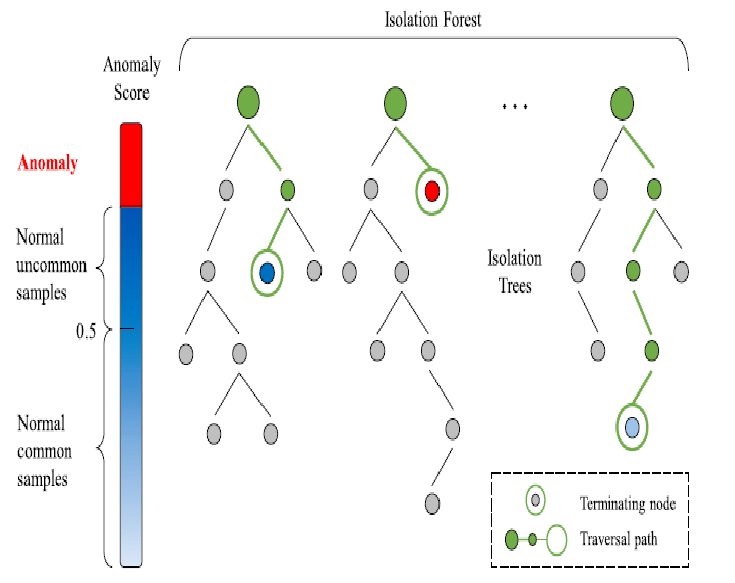

# Isolation Forests

Isolation Forests is an unsupervised machine learning algorithm that builds an ensemble of Isolation Trees (iTrees). These trees are binary structures used to isolate data points, particularly detecting anomalies within a dataset. Anomalies are likely to be closer to the root on an iTree, meaning the fewer decisions required to isolate a point, the more probable it is to be an anomaly.

## Steps

### 1. Tree Construction

- Randomly select a feature and a random splitting value to create partitions along that feature.
- Recursively partition the data into subspaces until each point is isolated or a maximum depth is reached.

### 2. Path Length Calculation

- Measure the average path length for each data point across all trees in the forest.
- Anomalies are expected to have shorter average path length (easy to isolate).

### 3. Anomaly Score

- Inversely proportional to its average path length. 

### 4. Thresholding

- Set a threshold to identify anomalies.

## Isolation Forests Pros

- Efficient for high-dimensional data and can handle large datasets.
- Scalable.

## Isolation Forests Cons

- Sensitive to parameters.
- May struggle with certain data patterns.